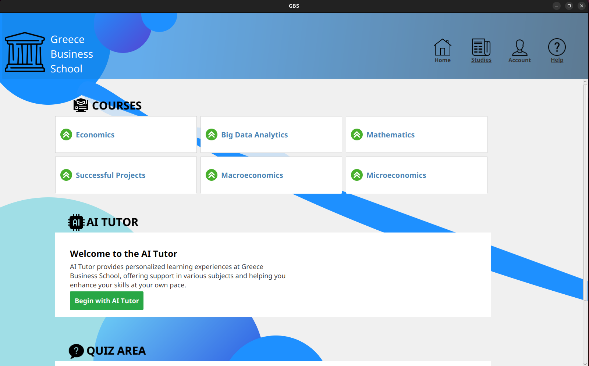

# 📘 GBS - Greece Business School


Welcome to the official repository of **GBS (Greece Business School)** — an e-learning platform built with **JavaFX** for the front-end and **PostgreSQL** for the database. This platform supports online learning, course management, and user interaction tailored for business school education.

---

## 🛠️ Tech Stack

- **Frontend:** JavaFX
- **Backend:** Java
- **Database:** PostgreSQL
- **AI Integration:** Google AI Studio API (for AI Tutor)
- **Speech Services:** TTS and STT
- **Build Tool:** Maven
- **IDE Recommended:** IntelliJ IDEA

---

## 🚀 Features

- User authentication (students, tutors, admins)
- ✅ Course creation
- ✅ Video and document content support
- ✅ Quiz and assessment module
- ✅ GPA for students and pdf generation for certification
- ✅ Admin dashboard for managing users
- 🔐 Secure password storage using **hashing + salt**
- 🤖 **AI Tutor** powered by AI Google Studio API
- 🗣️ **Text-to-Speech (TTS)** for reading course content aloud
- 🎙️ **Speech-to-Text (STT)** for voice input for speaking with AI

---

## 📚 Libraries & Dependencies

The following libraries and APIs are used in this project:

- **JavaFX** – for building the GUI
- **PostgreSQL JDBC Driver** – to connect Java with PostgreSQL
- **JUnit 5** – for unit testing
- **Json** – for handling JSON (used in AI API responses)
- **AI Studio API** – for AI tutor features
- **Google TTS** – for Text-to-Speech
- **Speech Recognition** – for Speech-to-Text

---

## 📦 Installation

### Prerequisites

- Java JDK 17 or higher
- PostgreSQL installed and running
- Maven or Gradle installed
- JavaFX SDK (if not bundled with your IDE)
- Internet access for AI and voice services
- Linux for TTS and STT

---

### 🧩 Steps to Run the Project

1. **Clone the repository:**

   ```bash
   git clone https://github.com/VoidG4/GBSproject.git
   cd GBSproject
    ```

2. **Set up the PostgreSQL database:**
- Create a new database named GBSproject in PostgreSQL
- Run the schema SQL file (/db/schema.sql) to create the necessary tables.
- Update your database credentials in the configuration a file named `config.properties` :
   ```properties
    db.url=jdbc:postgresql://localhost:5432/GBSproject
    db.username=your_db_username
    db.password=your_db_password
    ```

3. **Set up AI & Audio Configuration:**
- Obtain an API Key from Google AI Studio.
- Add the API key to your project in `config.properties` with names of variables *gemini.api.key* and *API_URL*
- Ensure microphone access is enabled on your device (for STT).
- (Linux) Make sure any required audio libraries are installed for TTS/STT functionality.

4. **Set up a Python environment for TTS and STT:**

    - Create a new Python virtual environment called `pyenv`:

      ```bash
      python3 -m venv pyenv
      ```

    - Activate the virtual environment:
      ```bash
      source pyenv/bin/activate
      ```

    - Install the necessary libraries for **Text-to-Speech (gTTS)** and **Speech Recognition (SpeechRecognition)**:

      ```bash
      pip install gTTS SpeechRecognition
      ```

    - To deactivate the virtual environment when done:

      ```bash
      deactivate
      ```

2. **Build and run the application:**
    ```bash
    mvn clean install
    mvn javafx:run
    ```

Or run directly from your IDE (e.g., IntelliJ IDEA):
- Open the project
- Make sure JavaFX is correctly set up in your SDK
- Run the main class (GBSApplication.java)

This ensures that the user has a specific environment set up for the TTS and STT libraries, keeping it isolated from other Python installations.

---

## 🔐 Security

- User passwords are **securely hashed and salted** before being stored in the PostgreSQL database.
- This ensures protection against common attacks like **rainbow table** or **brute-force** attempts.
- The application follows standard security practices for user authentication and data protection.

---

## 🔑 Configuration Security

- Sensitive information such as **API keys, database URLs, usernames**, and **passwords** are not hard-coded in the source code.
- These credentials are stored securely in a separate `config.properties` file.

Example:
```properties
db.url=jdbc:postgresql://localhost:5432/GBSproject
db.username=your_username
db.password=your_password
gemini.api.key=your_google_ai_key
API_URL=https://api.studio.google.com/...
```

---

## ✅ Testing

This project includes unit tests to ensure core functionality is working as expected.

### 🧪 Test Framework

- **JUnit 5** is used for writing and running tests.
- Tests are located in the `src/test/java/com/gbs/gbsproject` directory.

---

## 📖 User Manual

A complete user guide is available to help you understand how to use GBS features, including account setup, enrolling in courses, using the AI tutor, and interacting via voice.

📄 [Click here to view the User Manual](./Greece_Business_School_User_Manual.pdf)

Or find it inside the project folder `/Greece_Business_School_User_Manual.pdf`.

---

## 👨‍💻 Developer
- Name: VoidG4
- GitHub: https://github.com/VoidG4

---

## 📝 License
This project is for educational and demonstration purposes. All rights reserved.